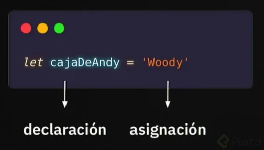

# Clase 2
Las variables son como cajas, en las cuales podemos almacenar cosas o sacrlas de ahí

Lo importante al crear variables es que tengan un nombre descriptivo y evitar las ambigüedades

```javascript
let cajaDeAndy = 'Woody';
```

