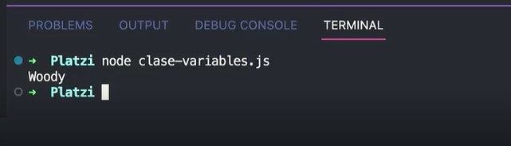

# Clase 2
Las variables son como cajas, en las cuales podemos almacenar cosas o sacrlas de ahí

Lo importante al crear variables es que tengan un nombre descriptivo y evitar las ambigüedades

```javascript
let cajaDeAndy = 'Woody';
```


Para crear una variable, podemos hacerlo de la siguiente manera:

- Inicializamos una variable: Para esto, debemos usar la palabra reservada let, const o var(esta úlñtima no es recomendada actualmente.)
- Declaramos la variable dándole un nombre descriptivo y evitando ambigüedades.
- Le asignamos un valor mediante el uso del signo `=` y el valor de nuestra variable.

## Visualizar el contenido de nuestra variable.

Para poder visualizar nuestra variable, podemos hacer uso de `console.log()`:

```javascript
let cajaDeAndy = 'Woody';
console.log(cajaDeAndy);

```

El resultado que nos devolverá la consola será: 

`Woody`

